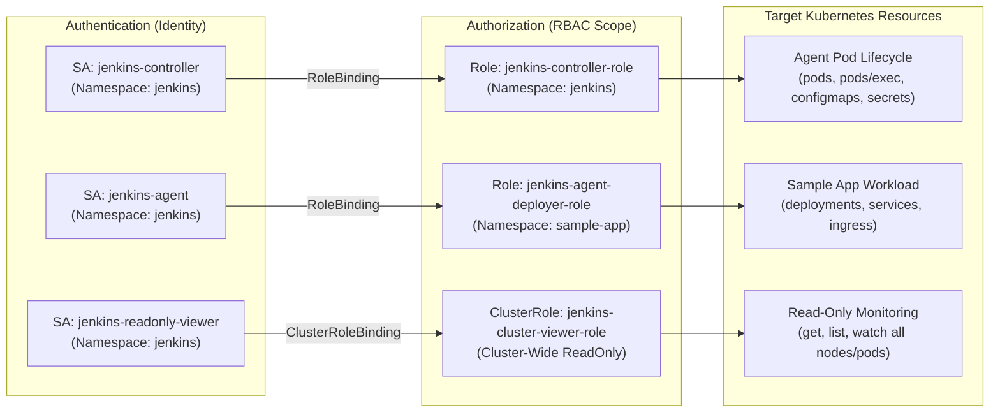

# 🔐 COMPLETE AUTHENTICATION (AuthN) & AUTHORIZATION (AuthZ) REFERENCE

This document details the complete **Authentication (AuthN)** and **Authorization (AuthZ / RBAC)** model implemented across both the **Kubernetes Cluster Layer** and the **Jenkins Application Layer**.

---

## 1. Jenkins Application Layer: AuthN & AuthZ

### 🔑 Authentication (AuthN)
Three distinct pre-configured accounts with discrete security postures:

| Username | Password | Role / Purpose | Auth Type |
|---|---|---|---|
| `admin` | `adminpassword123` | **Platform Administrator** | Local DB / Security Realm |
| `developer` | `devpassword123` | **CI/CD Engineer / Developer** | Local DB / Security Realm |
| `auditor` | `auditpassword123` | **Security / Compliance Auditor** | Local DB / Security Realm |

---

### 🛡️ Authorization (AuthZ) Matrix
Configured via `projectMatrix` in [jcasc/jenkins.yaml](file:///c:/Users/VIVEK%20J%20S/OneDrive/antigravity-poc/QuadGen%20Assesment/jcasc/jenkins.yaml):

| Jenkins Permission | `admin` | `developer` | `auditor` | `anonymous` |
|---|:---:|:---:|:---:|:---:|
| **Overall / Administer** | ✅ | ❌ | ❌ | ❌ |
| **Overall / Read** | ✅ | ✅ | ✅ | ❌ |
| **Job / Build (Trigger)** | ✅ | ✅ | ❌ | ❌ |
| **Job / Cancel** | ✅ | ✅ | ❌ | ❌ |
| **Job / Read & Workspace** | ✅ | ✅ | ✅ (Read only) | ❌ |
| **Job / Create & Configure**| ✅ | ❌ | ❌ | ❌ |
| **Agent / Provision & Build**| ✅ | ❌ | ❌ | ❌ |
| **Credentials / View & Manage** | ✅ | ❌ | ❌ | ❌ |
| **View / Create & Configure** | ✅ | ❌ | ❌ | ❌ |

---

## 2. Kubernetes Cluster Layer: AuthN & RBAC (AuthZ)

All service interactions use dedicated **Kubernetes ServiceAccounts** with scoped **Roles** and **RoleBindings**:



---

## 3. RBAC Policy Breakdown

### A. Jenkins Controller ServiceAccount (`jenkins-controller`)
- **Scope:** `jenkins` namespace only.
- **Allowed Actions:**
  - `pods`, `pods/exec`, `pods/log`, `pods/status`: Provision and clean up ephemeral agents.
  - `secrets`, `configmaps`, `persistentvolumeclaims`: Mount configuration and workspace volumes.

### B. Ephemeral Agent ServiceAccount (`jenkins-agent`)
- **Scope:** `sample-app` namespace only.
- **Allowed Actions:**
  - `apps/deployments`, `replicasets`: Deploy and rollout update application containers.
  - `services`, `endpoints`, `ingresses`: Expose application network endpoints.
  - `batch/jobs`, `cronjobs`: Run test and migration jobs.
- **Denied Actions (Least Privilege):**
  - **Cannot** access or modify controller pods in `jenkins` namespace.
  - **Cannot** access `kube-system` or read cluster secrets outside `sample-app`.

### C. Auditor ServiceAccount (`jenkins-readonly-viewer`)
- **Scope:** Cluster-wide (`ClusterRole`).
- **Allowed Actions:** `get`, `list`, `watch` on standard resources (`pods`, `services`, `deployments`, `events`).
- **Denied Actions:** `create`, `update`, `delete`, `exec`.

---

## 4. Validating AuthN & AuthZ

### Test Jenkins AuthN/AuthZ in Browser
1. Navigate to `http://localhost:8080`.
2. Login with `developer` / `devpassword123` ➔ Verify you can trigger `sample-app-pipeline`, but **Manage Jenkins** is hidden.
3. Login with `auditor` / `auditpassword123` ➔ Verify you can view build logs, but the **Build Now** button is disabled.
4. Login with `admin` / `adminpassword123` ➔ Verify full administrative control.

### Test Kubernetes RBAC with `kubectl auth can-i`
```bash
# Verify Agent can deploy to sample-app
kubectl auth can-i create deployments --as=system:serviceaccount:jenkins:jenkins-agent -n sample-app
# Expected: yes

# Verify Agent is blocked from modifying Jenkins controller
kubectl auth can-i delete pods --as=system:serviceaccount:jenkins:jenkins-agent -n jenkins
# Expected: no

# Verify Agent is blocked from touching kube-system
kubectl auth can-i create pods --as=system:serviceaccount:jenkins:jenkins-agent -n kube-system
# Expected: no
```
