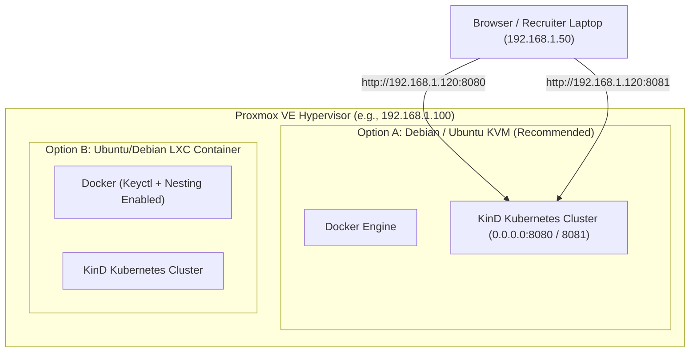

# 🖥️ PROXMOX VE DEPLOYMENT GUIDE (VM & LXC COMPATIBILITY)

This guide provides instructions for deploying this Kubernetes & Jenkins CI/CD POC on **Proxmox VE** (in a VM or privileged/nested LXC container), as well as on developer laptops.

---

## 🎯 Proxmox Architecture Options



---

## 🛠️ Step 1: Recommended Proxmox VM Setup (Fastest & Most Reliable)

1. Create a Linux VM (Debian 12 / Ubuntu 22.04 or 24.04):
   - **Cores:** 2 to 4 vCPUs
   - **RAM:** 4GB to 8GB RAM
   - **Disk:** 30GB+
   - **Network:** Bridge (`vmbr0`) - DHCP or Static IP (e.g. `192.168.1.120`)
2. Install Docker & KinD on the VM:
   ```bash
   # Install Docker
   curl -fsSL https://get.docker.com | sh
   sudo usermod -aG docker $USER
   
   # Install KinD & kubectl
   curl -Lo ./kind https://kind.sigs.k8s.io/dl/v0.22.0/kind-linux-amd64
   chmod +x ./kind && sudo mv ./kind /usr/local/bin/kind
   
   curl -LO "https://dl.k8s.io/release/$(curl -L -s https://dl.k8s.io/release/stable.txt)/bin/linux/amd64/kubectl"
   chmod +x ./kubectl && sudo mv ./kubectl /usr/local/bin/kubectl
   ```
3. Clone or unzip this repository on the VM:
   ```bash
   cd "QuadGen Assesment"
   make up
   # or bash scripts/bootstrap.sh
   ```
4. Access Jenkins directly across your LAN at:
   - **Jenkins UI:** `http://<PROXMOX_VM_IP>:8080`
   - **Sample App:** `http://<PROXMOX_VM_IP>:8081`

---

## 📦 Step 2: Proxmox LXC Container Setup (Lightweight Mode)

If deploying inside a **Proxmox LXC Container**, enable container nesting and keyctl features:

1. In Proxmox Web GUI:
   - Select your LXC Container ➔ **Options** ➔ **Features** ➔ Check **`Nesting`** and **`keyctl`**.
2. Alternatively via Proxmox Host shell (`/etc/pve/lxc/<CT_ID>.conf`):
   ```ini
   features: nesting=1,keyctl=1
   ```
3. Inside the LXC container, run:
   ```bash
   bash scripts/bootstrap.sh
   ```

---

## 🔒 Proxmox Firewall / Port Forwarding

Ensure the following ports are open on the VM/LXC firewall:
- **Port 8080:** Jenkins Controller Web UI
- **Port 8081:** Sample Application Web Endpoint
- **Port 5001:** Local Container Registry
- **Port 6443:** Kubernetes API Server (optional, for remote kubectl access)

---

## 🧪 Recruiter / Local Evaluation (Zero Proxmox Dependency)

If the recruiter runs this on their local machine (macOS / Windows / Linux), the exact same scripts run transparently without any modification:
```bash
make up
# Browser: http://localhost:8080
```
